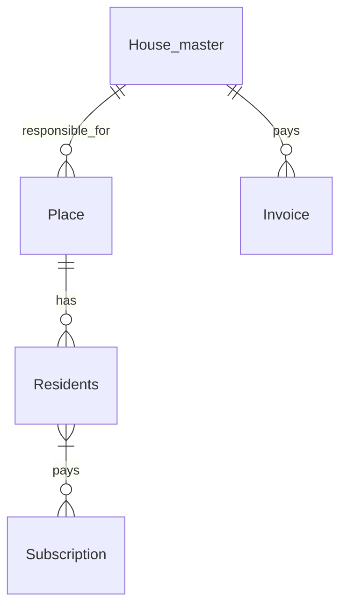

# 2024-11-09 Review and Questions Lesson

- [Recording](https://ankarabilim.sharepoint.com/sites/CENG351/Shared%20Documents/General/Recordings/Review%20and%20Questions%20Lesson%20(Session%201%20+%20Session%202)-20241109_160024-Meeting%20Recording.mp4)

## ER Design question

Simple Apartment Management System.

## Cheat Sheet

You are allowed to create and bring your own cheat sheet to exam.
It should be hand written and 1 side A4 paper.
I will collect your cheat sheets with your answers to the exam.
