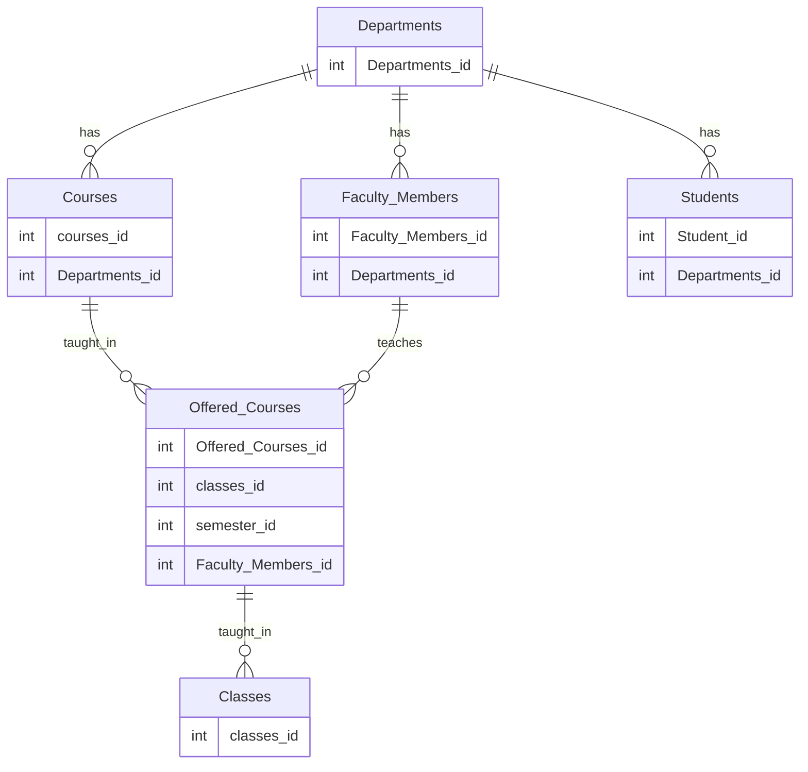

# 2024 midterm exam practice solutions

- [midterm exam practice solutions: 1-6](https://www.youtube.com/watch?v=wLpJbjslF4o)

- [midterm exam practice solutions 7](https://www.youtube.com/watch?v=tJnT0EnfhoY)

- [midterm exam practice solutions 8](https://www.youtube.com/watch?v=BRbX91_OXfE)

1. Open source, sqlite, mysql
Commercial: oracle, sql server

2. 

|    |                                                                                               |   |
|----|-----------------------------------------------------------------------------------------------|---|
| 1  | SQL is the abbreviation of Structured Query Language                                          | T |
| 2  | SQL contains sub languages such as DDL, DML, DCL, and TCL                                     | T |
| 3  | SQL is based on relational data model and set based operations                                | T |
| 4  | SQL queries allows quick and efficient retrieval of a large amount of records from a database | T |
| 5  | sqlite is an commercial database                                                              | F |
| 6  | A table cannot have a relation to itself since it will cause and indefiniteness               | F |
| 7  | Comparison with null can be meaningfully done with equals and not equals operator             | F |
| 8  | As being a sub language of SQL, DML has select, insert, update, and delete operations         | F |
| 9  | Open source databases are useless for Enterprise Companies                                    | F |
| 10 | GUI tools are only way to access databases                                                    | F |

2. 

4. 
SELECT CustomerId,FirstName
FROM Customers
WHERE FirstName LIKE 'A%'

5.
SELECT E.EmployeeId,
(select max(P.EmployeeId) FROM EMPLOYEE P 
WHERE E.EmployeeId > P.EmployeeId) AS PriorEmployeeID
E.FirstName,E.LastName FROM EMPLOYEE E

6.
SELECT 
AddressID
,COALESCE(StreetNumber, 'No Street Number') AS StreetNumber
,COALESCE(StreetName, 'No Street Name is given') AS StreetName
,COALESCE(City,'Unknown City') AS City
,COALESCE(PostalCode,'N/A') AS PostalCode
FROM Address
ORDER BY AddressID

7. 

SELECT 
FirstName
,LastName
FROM Employees E
WHERE 
(SELECT Salary FROM Salaries S2
where S2.Employee = E.EmployeeId)
>
(SELECT AVG(Salary) FROM Salaries S1
where S1.department_id = E.Department_Id
)

8. 

WITH SALARY_AVG AS
(
SELECT 
AVG(salary) AS avg_salary
,department_id
FROM Salaries 
GROUP BY department_id
)
SELECT * 
FROM Employees E
INNER JOIN salaries S
E.employee_id = S.employee_id
INNER JOIN SALARY_AVG SA
ON SA.department_id = s.department_id
WHERE 
S.Salary > SA.avg_salary

9. 

WITH SALARY_MAX AS
(
SELECT 
MAX(salary) AS max_salary
,department_id
FROM Salaries 
GROUP BY department_id
), SECOND_LARGEST
(
SELECT 
MAX(salary) AS avg_salary
,department_id
FROM Salaries S INNER JOIN
SALARY_MAX SM 
ON SM.department_id = S.department_id
and salary < SM.max_salary
Group by s.department_id
