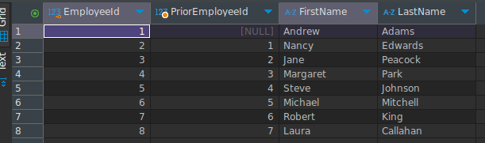
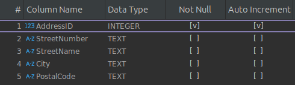

# 2024 midterm exam practice questions


1. Please write 2 open source and 2 commercial enterprise database names below. ( 10 points)

2. Please write if below statements are true (T) or false (F) (1 point each, 10 points)

| Question | True/False |
|---|---|
| SQL is the abbreviation of Structured Query Language |  |
| SQL contains sub languages such as DDL, DML, DCL, and TCL |  |
| SQL is based on relational data model and set based operations |  |
| SQL queries allows quick and efficient retrieval of a large amount of records from a database |  |
| SQL queries allows quick and efficient retrieval of a large amount of records from a database |  |
| A table cannot have a relation to itself since it will cause and indefiniteness |  |
| Comparison with null can be meaningfully done with equals and not equals operator |  |
| As being a sub language of SQL, DML has select, insert, update, and delete operations |  |
| Open source databases are useless for Enterprise Companies |  |


3. Please draw a simple ER diagram for a university course schedule system. (20 points) 
In your system, there will be departments, faculty members (i.e. professors), courses, classes, and offered courses.
Please mark 1-n relations in your ER Diagram.
Your diagram need to include possible columns for understanding the **relations between tables** but does not need to include every possible column.


4. Your coworker come to you with a following sql query.
He is trying to find customer whose first name starts with A.
Please fix the query so that it works.


```sql
FROM Customers
SELECT CustomerId,FirstName
WHERE FirstName = 'A%'
```

5. Please write the sql statements which will produce following result.




6. Null handling (10 points)

You are working with following Address table.



Write an SQL query that fills retrieves all addresses but handle null values in following way.

- If StreetNumber is NULL, display 'No Street Number' instead.
- If StreetName is NULL, display 'No Street Name is given' instead.
- If City is NULL, display 'Unknown City' instead.
- If PostalCode is NULL, display 'N/A' instead.

Your query should return all columns in the table while handling null issues. Order the results by AddressID.
