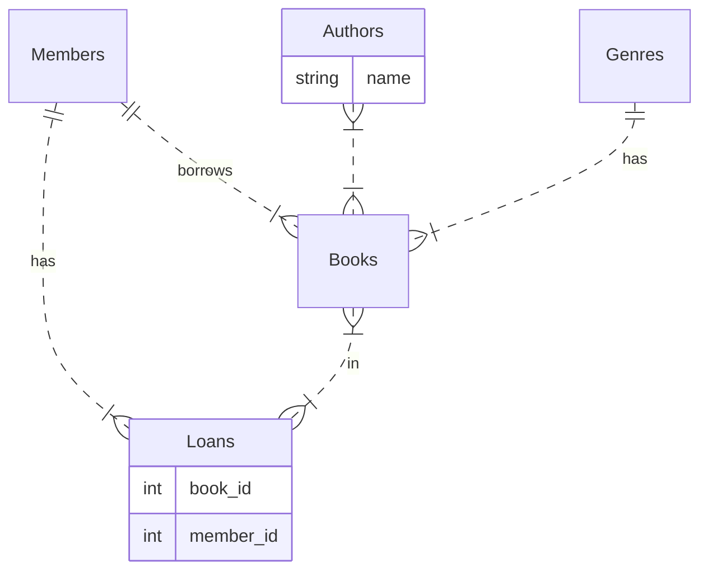
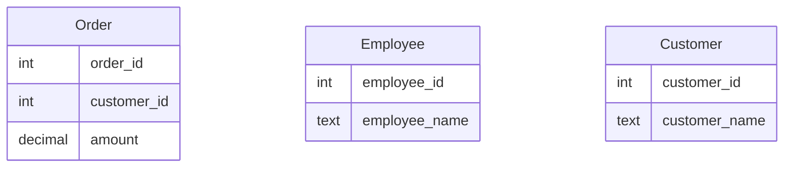
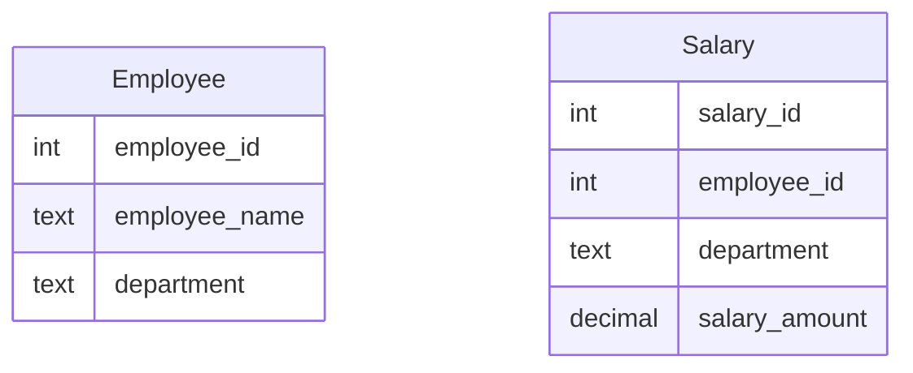

# ABU CENG 351 Midterm Exam 2024-11-13

- Student Number: 
- First Name:
- Last Name:


## Question 1 ( 10 points)

Please write names of 3 databases, we are working on our course.

## Answer 1

1. Oracle
2. SQL Server
3. Sqlite

- [Video ABU Midterm exam solutions: Question 01](https://www.youtube.com/watch?v=9Ad6yPanL58)


## Question 2 T/F (1 point each, 10 points) 

Please write if below statements are true (T) or false (F)

| #  | Question                              | T/F |
|----|----------------------------------------|-----|
| 1  | All SQL commands are case-sensitive                                                            |  F  |
| 2  | You can rename the output of an aggregate function using the AS keyword                        |  T  |
| 3  | NOSQL databases are inherently better than relational databases                                |  F  |
| 4  | The INNER JOIN will return all records from both tables even if there are no matching records. |  F  |
| 5  | Oracle is a well known open source database                                                    |  F  |
| 6  | The UNION operator will remove duplicates while combining results from two select statements   |  T  |
| 7  | SELECT * FROM table WHERE column = NULL; will return rows where the column is NULL.            |  F  |
| 8  | NULLvalue in SQL is considered equal to another NULL value when using = operator               |  F  |
| 9  | Commercial databases often come with licensing fees                                            |  T  |
| 10 | Most of our examples in the class was done using SQL Management Studio                         |  F  |


- [Video ABU Midterm exam solutions: Question 02](https://www.youtube.com/watch?v=JsCmaqObca8)


## Question 3 Simple ER Diagram (20 points)

Please draw a simple ER diagram for a system that manages a library's books, members, and loans.
This system also allows its members to search for books according to authors and genres of the books.
Please mark relations in your ER Diagram.
Your diagram need to include possible columns for understanding the **relations between tables** but does not need to include every possible column.

## Answer 3


- [Video ABU Midterm exam solutions: Question 03](https://www.youtube.com/watch?v=Drf2cu06NwY)


## Question 4 Fix SQL Query (10 Points)

Your coworker come to you with a following sql query.
Please write the correct version of the query so that it works.


```sql
order by TotalInvoice desc;
select CustomerId
sum(total) as TotalInvoice 
group by CustomerId
from Invoice 
```
## Answer 4


```sql
select CustomerId,
sum(total) as TotalInvoice 
from Invoice
order by TotalInvoice desc;
group by CustomerId

```

- [Video ABU Midterm exam solutions: Question 04](https://www.youtube.com/watch?v=5zPm0pecKvs)


## Order,Customer and Employee tables for Question 5-7




## Question 5 SQL Query (10 Points)

Consider the Order table. Write a query that will return the total amount spent by each customer?

## Answer 5


```sql
select customer_id,
sum(amount) as TotalOrders
from Order
group by customer_Id
order by TotalOrders desc;

```

- [Video ABU Midterm exam solutions: Question 05](https://www.youtube.com/watch?v=dfaGzQT_zGA)


## Question 6 which names are common (10 Points)

Write a query that will find which names are common in Employee and Customer tables.

## Answer 6 A


```sql
SELECT c.FirstName from Customer c
INTERSECT
SELECT e.FirstName from Employee e 
```

## Answer 6 B


```sql
SELECT c.FirstName,e.FirstName
FROM Customer c
INNER JOIN Employee e
ON c.FirstName  = e.FirstName 
```


- [Video ABU Midterm exam solutions: Question 06](https://www.youtube.com/watch?v=gfEFSMJlAg8)


## Question 7 Highest 10 orders

Please write a query that will find highest 10 orders and which customers has given that orders.

## Answer 7 A


```sql
SELECT o.amount,o.customer_id,c.customer_name FROM ORDER o
INNER JOIN Customer c
ON c.customer_id = o.customer_id
ORDER BY amount desc
LIMIT 10
```

## Answer 7 B


```sql
SELECT o.amount,o.customer_id FROM ORDER o
ORDER BY amount desc
LIMIT 10
```


- [Video ABU Midterm exam solutions: Question 07](https://www.youtube.com/watch?v=lz_O3hSYBjw)


## Employee and Salary tables for Question 8-9

We have Employee and Salary tables.
Every employee has only 1 salary row in the Salary table.




## Question 8 (10 Points)

Write a SQL query to find the names of employees who earn more than the average salary of their department. 
You query should show salary, department,  employee name and id information.

## Answer 8

Question is same as practice questions 7 and 8, except it does not enforce usage of join or subquery; therefore, either answer is acceptable here.

- [Video: midterm exam practice solutions 7](https://www.youtube.com/watch?v=tJnT0EnfhoY)

- [Video: midterm exam practice solutions 8](https://www.youtube.com/watch?v=BRbX91_OXfE)


## Question 9 (10 Points) (10 Points)

Find the second highest salary owner for every department.
That is if we have highest two salaries of 1000 and 990 in HR department, you should show the salary 990, HR department and employee name and id information in your result set.


- [Video ABU Midterm exam solutions: Question 09](https://www.youtube.com/watch?v=FCbWuZ2TXEs)


## Test script for Question

You can use following [sql file](Midterm-Practice-Exam-question7-8-9TestScript.sql)  for testing the solutions

## Answer 9 A

```sql
WITH MAX_SALARIES AS
(
SELECT department,MAX(salary_amount) as max_salary FROM Salary s 
GROUP BY department 
),
 EMP_SALARIES AS
(
SELECT e.employee_id,e.employee_name,e.department,s.salary_amount 
from Employee e
INNER JOIN Salary s 
ON e.employee_id  = s.employee_id 
),
SECOND_LARGEST AS
(
SELECT MAX(E.salary_amount) AS Second,M.department  FROM EMP_SALARIES E 
INNER JOIN MAX_SALARIES M
ON E.department = M.department
WHERE E.salary_amount < M.max_salary
GROUP BY M.department 
)
SELECT * FROM EMP_SALARIES E2
INNER JOIN SECOND_LARGEST S2
ON S2.second = E2.salary_amount AND S2.department = E2.department
;
```

## Answer 9 B

```sql
WITH MAX_SALARIES AS (
SELECT s.department, max(salary_amount) as max_salary FROM Salary s 
GROUP BY S.department 
), 
EMP_SALARY AS (
SELECT e.employee_name, s.employee_id, s.department,salary_amount  FROM Salary s 
INNER JOIN Employee e 
ON e.employee_id  = s.employee_id 
Order by s.department, s.salary_amount DESC
), FILTER_LARGEST AS (
SELECT es.employee_name,es.employee_id,es.department, es.salary_amount FROM EMP_SALARY ES
WHERE ES.salary_amount < ( SELECT max_salary from MAX_SALARIES MS where MS.department = ES.department)
), SECOND_LARGEST AS (

SELECT FS.department, max(FS.salary_amount) as max_salary FROM FILTER_LARGEST FS 
GROUP BY FS.department  
)
SELECT * FROM SECOND_LARGEST SL
INNER JOIN EMP_SALARY ES
ON ES.salary_amount = SL.max_salary and ES.department = SL.department


```


## Answer 9 C

Some of your friends used window functions for solutions like below.
I also accept these as solution too.


```sql
WITH SAL AS
(
SELECT e.employee_id
,e.employee_name
,e.department
,s.salary_amount 
,row_number() OVER (PARTITION BY e.department order by s.salary_amount DESC ) AS SALARY_RANK
from Employee e
INNER JOIN Salary s 
ON e.employee_id  = s.employee_id 
)
SELECT * FROM SAL
WHERE SALARY_RANK = 2
;
```

