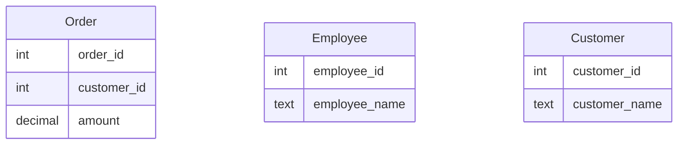
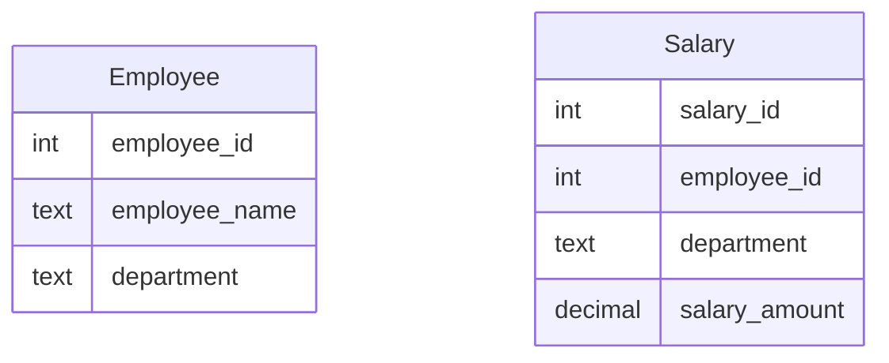

# ABU CENG 351 Midterm Exam 2024-11-13

- Student Number: 
- First Name:
- Last Name:


## Question 1 ( 10 points)

Please write names of 3 databases, we are working on our course.

## Question 2 T/F (1 point each, 10 points)

Please write if below statements are true (T) or false (F)

| #  | Question                              | T/F |
|----|----------------------------------------|-----|
| 1  | All SQL commands are case-sensitive                                                            |     |
| 2  | You can rename the output of an aggregate function using the AS keyword                        |     |
| 3  | NOSQL databases are inherently better than relational databases                                |     |
| 4  | The INNER JOIN will return all records from both tables even if there are no matching records. |     |
| 5  | Oracle is a well known open source database                                                   |     |
| 6  | The UNION operator will remove duplicates while combining results from two select statements   |     |
| 7  | SELECT * FROM table WHERE column = NULL; will return rows where the column is NULL.            |     |
| 8  | NULLvalue in SQL is considered equal to another NULL value when using = operator               |     |
| 9  | Commercial databases often come with licensing fees                                            |     |
| 10 | Most of our examples in the class was done using SQL Management Studio                         |     |


## Question 3 Simple ER Diagram (20 points)

Please draw a simple ER diagram for a system that manages a library's books, members, and loans.
This system also allows its members to search for books according to authors and genres of the books.
Please mark relations in your ER Diagram.
Your diagram need to include possible columns for understanding the **relations between tables** but does not need to include every possible column.


## Question 4 Fix SQL Query (10 Points)

Your coworker come to you with a following sql query.
Please write the correct version of the query so that it works.


```sql
order by TotalInvoice desc;
select CustomerId
sum(total) as TotalInvoice 
group by CustomerId
from Invoice 
```

## Order,Customer and Employee tables for Question 5-7




## Question 5 SQL Query (10 Points)

Consider the Order table. Write a query that will return the total amount spent by each customer?


## Question 6 which names are common (10 Points)

Write a query that will find which names are common in Employee and Customer tables.

## Question 7 Highest 10 orders

Please write a query that will find highest 10 orders and which customers has given that orders.


## Employee and Salary tables for Question 8-9

We have Employee and Salary tables.
Every employee has only 1 salary row in the Salary table.




## Question 8 (10 Points)

Write a SQL query to find the names of employees who earn more than the average salary of their department. 
You query should show salary, department,  employee name and id information.


## Question 9 (10 Points) (10 Points)

Find the second highest salary owner for every department.
That is if we have highest two salaries of 1000 and 990 in HR department, you should show the salary 990, HR department and employee name and id information in your result set.