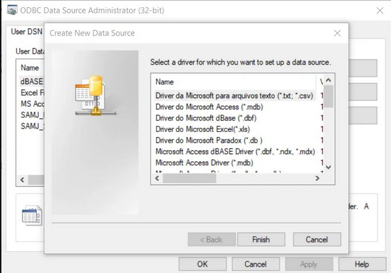
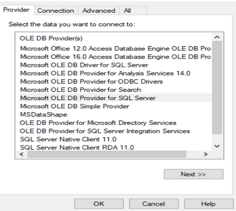

## Veri tabanı sürücüleri (database drivers)

### Dillere özel sürücüler

Dillere göre özel sürücüler, populer programlama dilleri için vardır.
Örneğin

SQLite

- [.NET (C#-VB.NET) SQLite](https://learn.microsoft.com/en-us/dotnet/standard/data/sqlite/?tabs=net-cli)
- [Python SQLite](https://docs.python.org/3/library/sqlite3.html)
- [PHP SQLite](https://www.php.net/manual/en/book.sqlite3.php)
- [Java JDBC SQLite](https://github.com/xerial/sqlite-jdbc)
- [Nodejs SQLite](https://nodejs.org/api/sqlite.html)
- [Ruby SQLite](https://github.com/sparklemotion/sqlite3-ruby)

SQL Server

 - .NET (C#, VB.NET)
 - Java (JDBC)
 - Go
 - Nodejs (Javascript)
 - PHP
 - Python

Oracle

 - .NET (C#, VB.NET) 
 - Java (JDBC)
 - [python oracledb](https://python-oracledb.readthedocs.io/en/latest/user_guide/installation.html)
 - [PHP Oracle](https://www.oracle.com/developer/php/)
 - [R Oracle](https://docs.oracle.com/cd/E11882_01/doc.112/e36761/intro.htm)
 - [node oracledb](https://oracle.github.io/node-oracledb/)
 - [ruby oracle](https://www.oracle.com/developer/ruby-developers)

Ayrıca [script dilleri için oracle](https://www.oracle.com/database/technologies/scripting-languages.html) sayfasına bakınız.

### Doğal (Native) sürücüler

Eğer varsa ilgili programlama dilininin doğal sürücüsü tercih edilmelidir.
Örneğin [SQL server hangi sürücülerde hangi özellikleri desteklediğini gösteren bir matriks](https://learn.microsoft.com/en-us/sql/connect/driver-feature-matrix?view=sql-server-ver16
) yayınlamaktadır.
Java ve .NET çok kabul edilen programlama dilleri olarak ayrıca bir çok veri tabanı için kendi sürüclerine sahiptir.

### JDBC sürücüleri

Java kurumsal bir programlama dili olarak çok başarılıdır.
Bundan dolayı java'nın desteklenmediği veri tabanı bulmak neredeyse imkansızdır.

- [Java Database Connectivity](https://en.wikipedia.org/wiki/Java_Database_Connectivity)

### .NET sürücüleri

.NET (C# ve VB.NET) için Microsoft ve diğer veri tabanı üreticileri tarafından hazırlanmış bir çok veri tabanı sürücüsü bulunmaktadır.
Bunlar bu veritabanları .NET ile doğal sürücü olarak bağlanılmasına izin vermektedir.

- [.NET SQLite](https://learn.microsoft.com/en-us/dotnet/standard/data/sqlite/?tabs=net-cli)
- [.NET Oracle](https://www.oracle.com/de/database/technologies/appdev/dotnet.html)
- [.NET SQL-Server](https://learn.microsoft.com/en-us/sql/connect/ado-net/introduction-microsoft-data-sqlclient-namespace?view=sql-server-ver16)

### ODBC sürücüleri

Bu en eski veri tabanı bağlantı teknolojisidir.
Eğer daha ileri sürücüler özellikle doğal sürücü varsa tercih edilmemelidir.

[Open Database Connectivity](https://en.wikipedia.org/wiki/Open_Database_Connectivity)

- [Unix ODBC](https://www.unixodbc.org/) 
- [Microsoft ODBC](https://learn.microsoft.com/en-us/sql/odbc/admin/odbc-data-source-administrator?view=sql-server-ver16)

### OLEDB sürücüleri

Microsoft'un ODBC'den sonra çıkardığı bağlantı teknolojisidir.
Özellikle window üstünde daha hızlı ve iyi çalışır.
Ama yine doğal sürücüler tercih edilmelidir.

