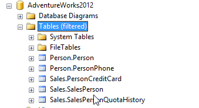

## Database Schema Object Names

- [Server Name].[Database Name].[Schema Name].Object Name
- [Database Name].[Schema Name].Object Name
- [Schema Name].Object Name
- Object Name

### Schema Object names 2

- The best practice is to use the schema name by appending it. Example Sales.SalesPerson
- I recommend not giving the same name to the schema and the objects. (Although Microsoft has not followed this)

### Database links

Above information is useful since databases are interconnected with each other.
An oracle database may be connected to MySQL, PostgreSQL, SQL Server or DB2.
Another SQL Server could be connected to Oracle and DB2.
Database links will connect database servers to each other and will allow them to query other database servers.

- [Database link SQL Server](https://learn.microsoft.com/en-us/sql/relational-databases/linked-servers/create-linked-servers-sql-server-database-engine?view=sql-server-ver16)
- [Database Link Oracle](https://docs.oracle.com/en/database/oracle/oracle-database/19/sqlrf/CREATE-DATABASE-LINK.html)

