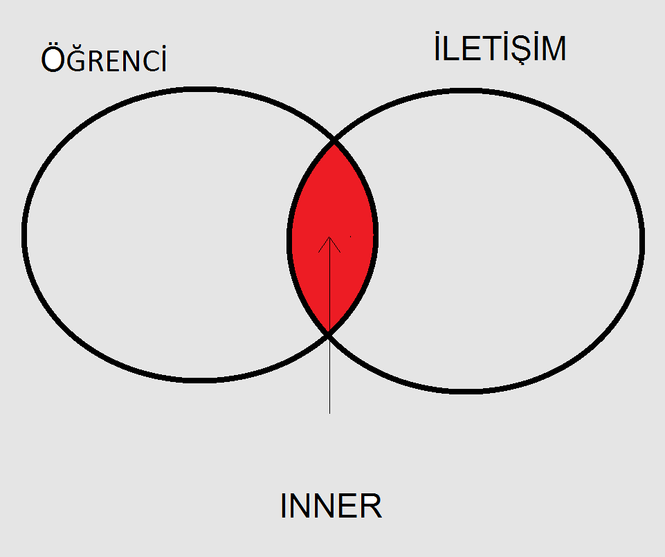

## JOIN Concept

- joins rows from more than one table according to the given criteria.
- Generally, primary key and foreign key joined.
- For example, Student and Contact table are joined.
- It would be good to think of the join process as a Venn diagram.
- But actually, it is not a set operation





## JOIN Syntax

Syntax: ansi-sql-89 

You can see below syntax for join but please do not use it.
Using join condition explicitly would be better.


``` sql
SELECT ...
FROM   Table1, Table2
WHERE  Table1.KolonA = Table2.KolonA;

```

syntax-ansi-sql-92

``` sql
SELECT ...
FROM   Table1 JOIN Table2
ON  Table1.KolonA = Table2.KolonA;


```

