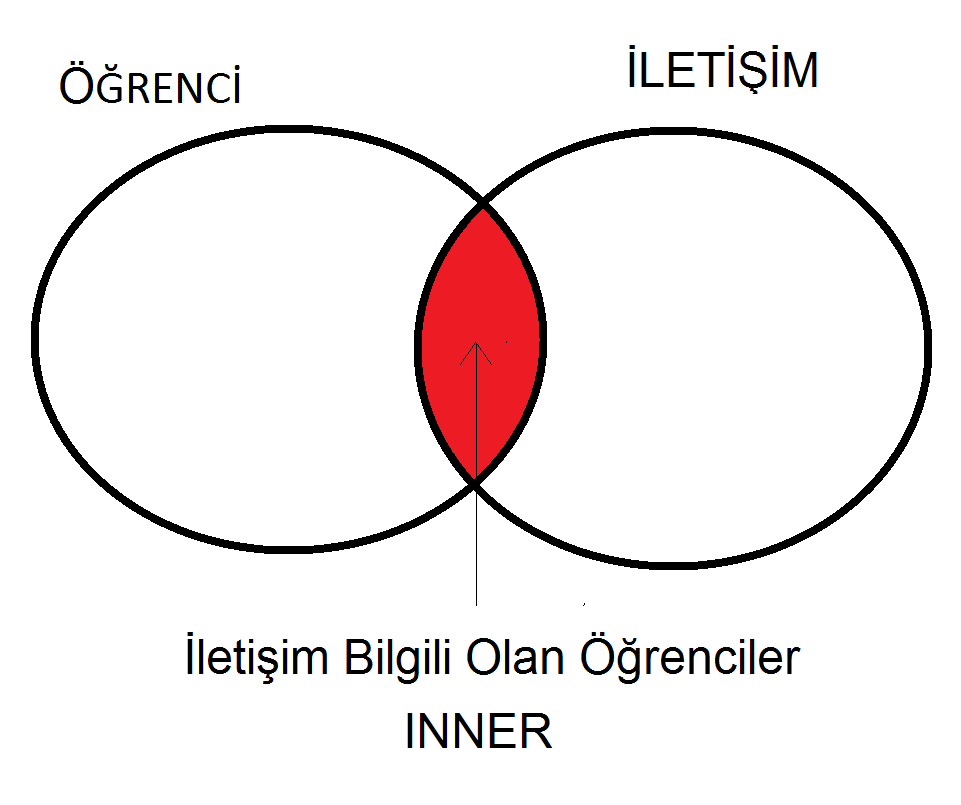

## Inner Join  - İç Birleşim




- Her iki tabloda eşleşmiş olan kayıtları getirir.
- Örneğin bir öğrencinin iletişim bilgisi yoksa, o öğrencinin bilgileri gelmez.
- Eşleşme ON kelimesinde verilen kolonlara göre yapılır. Birden fazla kolon birleştirilebilir.
- Eğer birleştime \textbf{=} ile yapılıyorsa, equi-join diyede adlandırılır.


``` sql
SELECT OgrenciNo,IletisimTipi,IletisimDegeri
FROM   OGRENCI INNER JOIN ILETISIM
ON  OGRENCI.OgrenciKey = ILETISIM.OgrenciKey;
```


