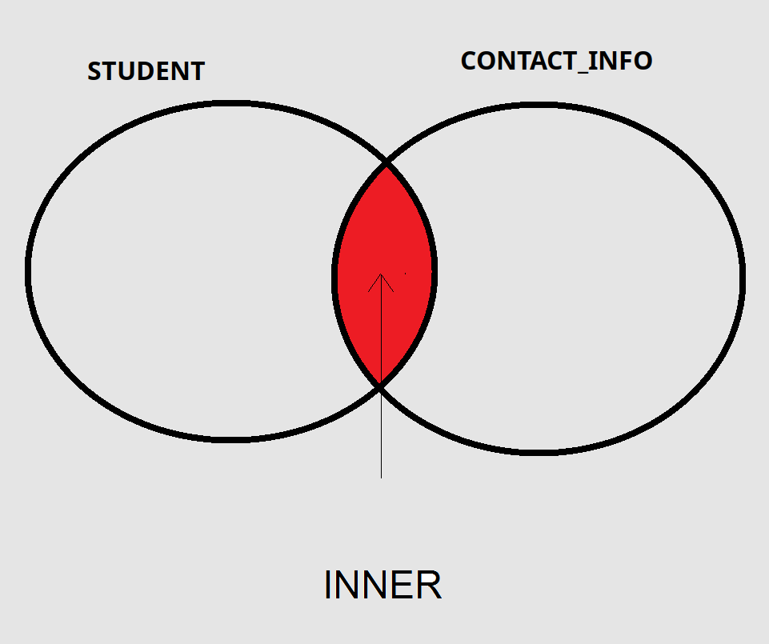

## Inner Join  



- Inner join brings the records that match the join condition in both tables.
In the following example, 2 tables, Artist and Album are joined and join condition is explicitly given using **ON A.ArtistId  = B.ArtistId** line

```sql
SELECT A.Name AS ArtistName
, B.Title AS AlbumTitle
FROM Artist A
INNER JOIN Album B
ON A.ArtistId  = B.ArtistId 
```

If column name is same in the both tables, we can forgo **ON**, like below.
I dislike this usage and never use it.
Please use explicit ON condition.

```sql
SELECT A.Name AS ArtistName
, B.Title AS AlbumTitle
FROM Artist A
INNER JOIN Album B
```

- The match is made according to the columns given in the ON word. More than one column can be combined.
- For example, if a student does not have contact information, that student's information will not come.


- If = operator is used in a join, it is also called an equi-join.
- other operators like >, >= could also be used in join conditions then they are called non-equi-join.
Non-equi-joins are rarely used.


See [example from Perplexity](https://www.perplexity.ai/search/give-me-a-good-example-for-non-d8cZSbJ7QhuXbD43voHPcw)


