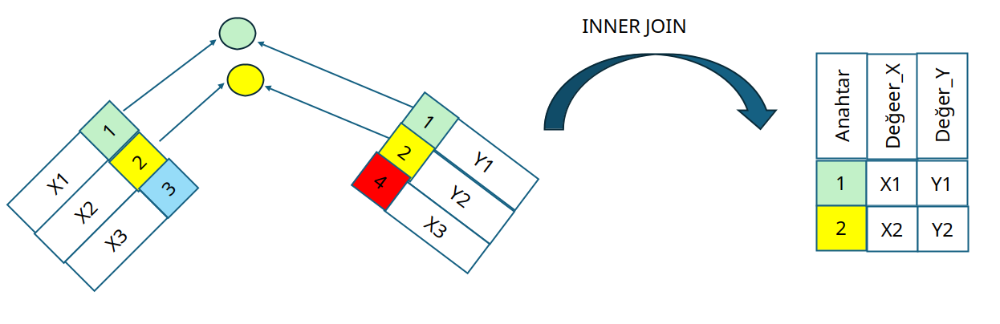

## İç Birleştirme (Inner Join) 

{width=4in}


- Her iki tabloda eşleşmiş olan kayıtları getirir.
- Örneğin bir öğrencinin iletişim bilgisi yoksa, o öğrencinin bilgileri gelmez.
- Eşleşme ON kelimesinde verilen kolonlara göre yapılır. Birden fazla kolon birleştirilebilir.
- Eğer birleştirme **=** ile yapılıyorsa, eşitlik birleştirme (equi-join) diye de adlandırılır.


```sql
SELECT OgrenciNo,IletisimTipi,IletisimDegeri
FROM   OGRENCI INNER JOIN ILETISIM
ON  OGRENCI.OgrenciKey = ILETISIM.OgrenciKey;
```




Yukarıdaki örnekte X ve Y tablolarındaki aynı anahtar değerleri (1 ve 2) birleştirilir. Ama X tablosundaki 3 anahtar değeri ve Y tablosundaki 4 anahtar değeri 2 tabloda birden aynı olmadığı için iç birleştirme sonucuna getirilmemiştir.


ANSI-SQL-92 birleştirmelerinin doğru söz dizimi aşağıdaki söz dizimidir.

```sql
SELECT ...
FROM   Table1 JOIN Table2
ON  Table1.KolonA = Table2.KolonA;
```

**Chinook örnek**

2 tabloyu birleştirme, Artist ve Album

```sql
SELECT A.Name AS ArtistName
, B.Title AS AlbumTitle
FROM Artist A
INNER JOIN Album B
ON A.ArtistId  = B.ArtistId 
```

3 tabloyu birleştirme, Artist, Album ve Track.

```sql
SELECT A.Name AS ArtistName
, B.Title AS AlbumTitle
, T.Name  AS TrackName
FROM Artist A
INNER JOIN Album B
ON A.ArtistId  = B.ArtistId 
INNER JOIN Track T ON T.AlbumId  = B.AlbumId   
```


**ANSI-SQL-89 iç birleştirme sözdizimine dikkat edin**

Aşağıda iç birleştirme için sözdizimini görebilirsiniz ancak lütfen kullanmayın.
Birleştirme koşulunu açıkça kullanmak her zaman daha iyi olur.


```sql
SELECT ...
FROM   Table1, Table2
WHERE  Table1.KolonA = Table2.KolonA;
```

Tüm veritabanlarında çalışmaya devam edecektir ancak join anahtar sözcüğünü kullanarak birleştirme koşulları vermek her zaman daha iyidir.
Ayrıca sol ve sağ birleştirmeler (left right join) için ANSI-SQL-92 sözdizimi daha anlaşılırdır.


