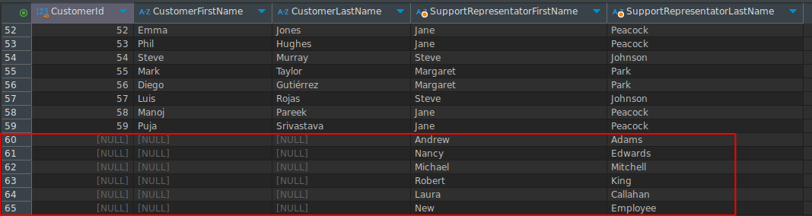
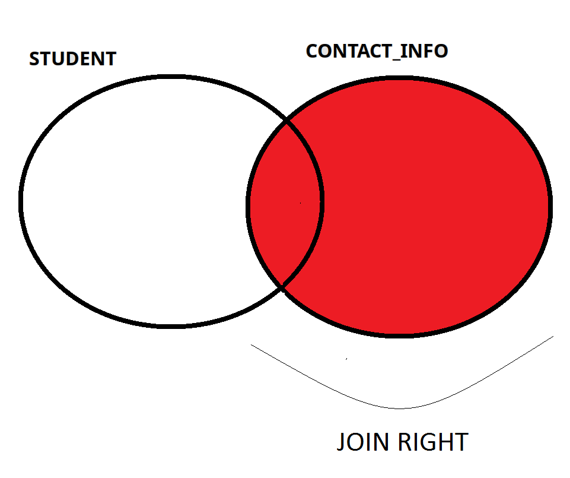
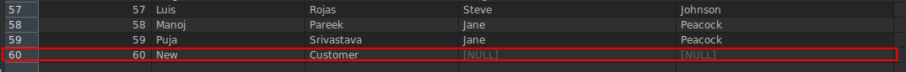
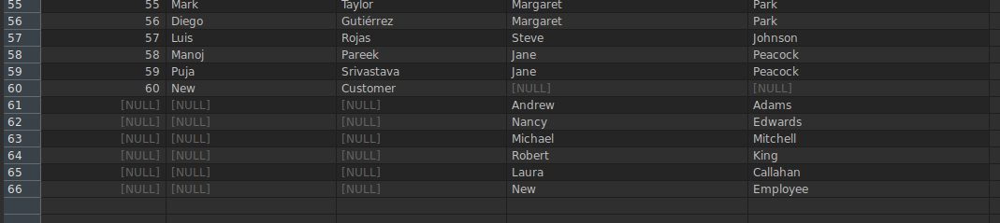
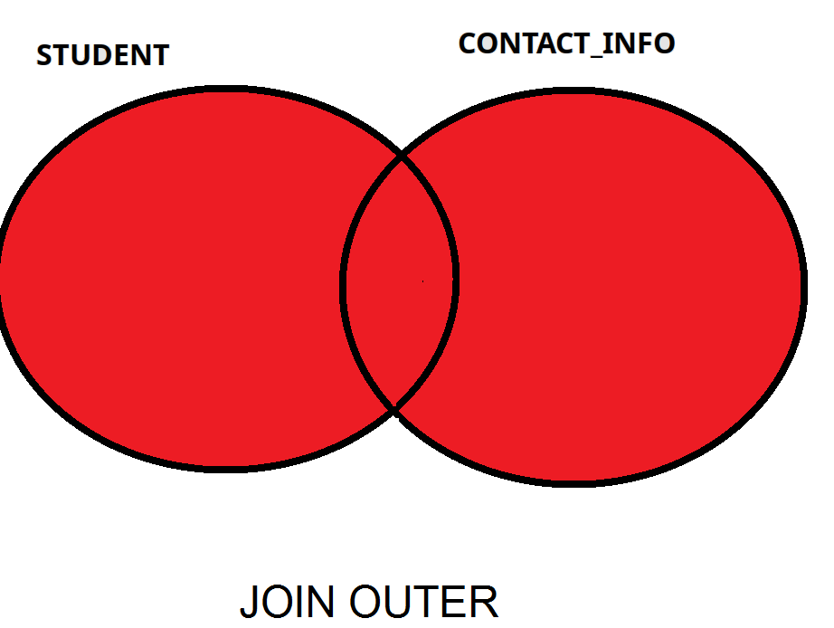

## Outer Join  

- All rows from the specified table are in the result set but only the matching rows from the other table are in the result.
- Specified table(s) is decided by using  "LEFT, RIGHT, FULL" keywords.
- All rows of the specified table are in the result set.


- NULL is used for the column information that does not match the given join condition.
- For example, NULL will be in the  information section for new employees who do not assigned any customers information.
Or, any new customer who does not have support representation employee will not be in the results.

Lets insert a new customer with no support representation with following query.

```sql
INSERT INTO Customer( FirstName, LastName,  Email )
VALUES( 'New Customer First Name', 'New Customer Last Name',  'new@customer.com');
```

Also insert a new employee.

```sql

INSERT INTO Employee( FirstName, LastName)
VALUES( 'New Employee First Name', 'New Employee Last Name' ); 
```

First lets start with basic Inner join

```sql
SELECT 
c.CustomerId
,c.FirstName as CustomerFirstName 
,c.LastName  as CustomerLastName
,e.FirstName as SupportRepresentatorFirstName
,e.LastName as SupportRepresentatorLastName
from Customer c INNER JOIN Employee e 
on c.SupportRepId  = e.EmployeeId 
```
This will bring as 59 rows.


Since we used inner join only those customer who has support employees are in the result.
We do not see either of our newly inserted customer or employee in the result.

## Right Outer Join 

Change inner join to right join in our sql query.

```sql
SELECT 
c.CustomerId
,c.FirstName as CustomerFirstName 
,c.LastName  as CustomerLastName
,e.FirstName as SupportRepresentatorFirstName
,e.LastName as SupportRepresentatorLastName
from Customer c RIGHT JOIN Employee e 
on c.SupportRepId  = e.EmployeeId 
```

We see 6 new rows in the result set.
These new rows are those employee with no assigned customers.
Since they have no matching information in the Customer table, the columns from Customers are null in the result.



The Venn diagram for Right join is below.




## Left Outer Join 

Change inner join to left join in our sql query.

```sql
SELECT 
c.CustomerId
,c.FirstName as CustomerFirstName 
,c.LastName  as CustomerLastName
,e.FirstName as SupportRepresentatorFirstName
,e.LastName as SupportRepresentatorLastName
from Customer c LEFT JOIN Employee e 
on c.SupportRepId  = e.EmployeeId 
```

We see only 1 new rows in the result set.
This new row is our newly inserted customer with no support representation.
Since this customer have no matching information in the Employee table, the columns from Employee are null in the result.



The Venn diagram for Left join is below.


## Full Outer Join  

Change inner join to full join in our sql query.

```sql
SELECT 
c.CustomerId
,c.FirstName as CustomerFirstName 
,c.LastName  as CustomerLastName
,e.FirstName as SupportRepresentatorFirstName
,e.LastName as SupportRepresentatorLastName
from Customer c FULL JOIN Employee e 
on c.SupportRepId  = e.EmployeeId 
```

We see only 7 new rows in the result set.
One new row is our newly inserted customer with no support representation.
And other 6 rows are those employees with no assigned customers.
Any not matching information are returned as null in this result set as below.




The Venn diagram for Full outer join is below.



