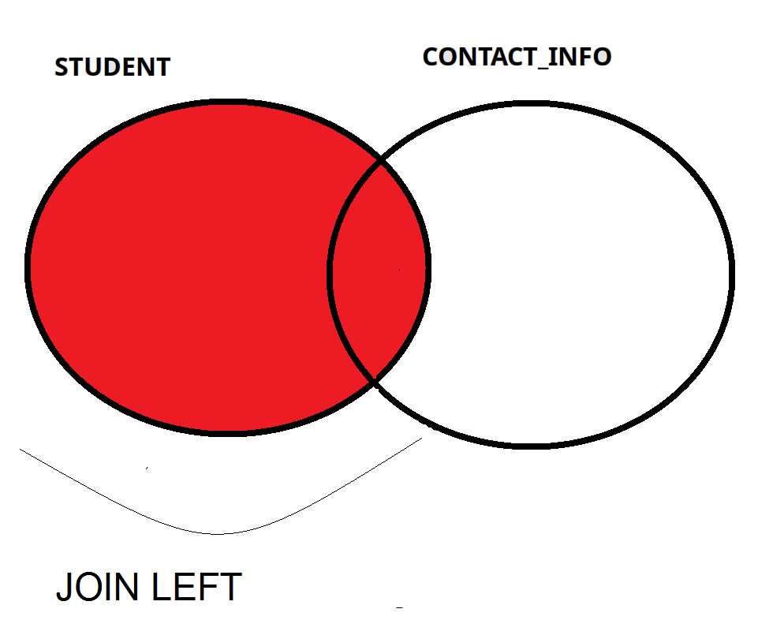

## Outer Join  - Dış Birleşim

- Belirtilen tablodan tüm satırları getirirken, diğer tablodan sadece eşleşen satırları getirir.
- Bir tablonun satırlarının tümü getirilir.
- Bu tablo "LEFT, RIGHT, FULL" ile belirtilir.
- Eşleşmeyen özellik bilgileri için NULL getirilir.
- Örneğin İletişim bilgisi olmayan öğrenciler için iletişim bilgisi kısmında NULL yazılacaktır.





SQL-left-join-syntax-ansi-sql-92

```sql
SELECT OgrenciNo,IletisimTipi,IletisimDegeri
FROM   OGRENCI LEFT INNER JOIN ILETISIM
ON  OGRENCI.OgrenciKey = ILETISIM.OgrenciKey;
```

## Outer Join Right  - Dıştan Birleşim Sağdan


RIGHT JOIN ANSI SQL

```sql
SELECT OgrenciNo,IletisimTipi,IletisimDegeri
FROM   OGRENCI RIGHT JOIN ILETISIM
ON  OGRENCI.OgrenciKey = ILETISIM.OgrenciKey;
```


## Full Outer Join  - Ful Dış Birleşim


SQL-full-outer-join-syntax-ansi-sql-92

```sql
SELECT OgrenciNo,IletisimTipi,IletisimDegeri
FROM   OGRENCI FULL OUTER JOIN ILETISIM
ON  OGRENCI.OgrenciKey = ILETISIM.OgrenciKey;
```


