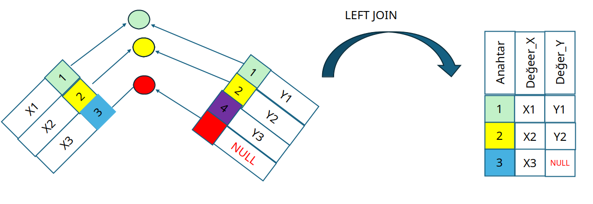

## Dış Birleştirme (Outer Join)

- Belirtilen tablodan tüm satırları getirirken, diğer tablodan sadece eşleşen satırları getirir.
- Bir tablonun satırlarının tümü getirilir.
- Bu tablo "LEFT, RIGHT, FULL" ile belirtilir.
- Eşleşmeyen özellik bilgileri için NULL getirilir.
- Örneğin İletişim bilgisi olmayan öğrenciler için iletişim bilgisi kısmında NULL yazılacaktır.

### Sol Dış Birleştirme (Left Outer Join)

Sol Dış Birleştirme veya Sol Birleştirme olarak bilinir.


{width=4in}

Sol birleştirmede, SQL yazımı sırasında sol (left) tarafta kalan tablodaki tüm satırlar getirilir.





Yukarıdaki örnekte X ve Y tablolarındaki aynı anahtar değerleri (1 ve 2) birleştirilir. 
Sol birleştirme yaptığımız için X tablosundaki 3 anahtar değeride sonuca getirilir.
Ama bu 3 değerinin bir karşılığı olmadığı için sonuç olarak null değeri gözükecektir.
Y tablosundaki 4 anahtar değeri 2 tabloda birden aynı olmadığı için birleştirme sonucuna getirilmemiştir.

Aşağıda Öğrenci ve İletişim tablolarının sol birleştirme örneği görülebilir.

```sql
SELECT OgrenciNo,IletisimTipi,IletisimDegeri
FROM   OGRENCI LEFT INNER JOIN ILETISIM
ON  OGRENCI.OgrenciKey = ILETISIM.OgrenciKey;
```


### Sağ Dış Birleştirme (Right Outer Join)

{width=4in}


```sql
SELECT OgrenciNo,IletisimTipi,IletisimDegeri
FROM   OGRENCI RIGHT JOIN ILETISIM
ON  OGRENCI.OgrenciKey = ILETISIM.OgrenciKey;
```


Yukarıdaki örnekte X ve Y tablolarındaki aynı anahtar değerleri (1 ve 2) birleştirilir. 
Sağ birleştirme yaptığımız için Y tablosundaki 4 anahtar değeride sonuca getirilir.
Ama bu 4 değerinin bir karşılığı olmadığı için sonuç olarak null değeri gözükecektir.
X tablosundaki 3 anahtar değeri 2 tabloda birden aynı olmadığı için birleştirme sonucuna getirilmemiştir.

### Tam Dış Birleştirme (Full Outer Join)

{width=4in}


```sql
SELECT OgrenciNo,IletisimTipi,IletisimDegeri
FROM   OGRENCI FULL OUTER JOIN ILETISIM
ON  OGRENCI.OgrenciKey = ILETISIM.OgrenciKey;
```


Yukarıdaki örnekte X ve Y tablolarındaki aynı anahtar değerleri (1 ve 2) birleştirilir. 
Hem sağ hem sol birleştirme yaptığımız için X tablosundaki 3 anahtar değeride sonuca getirilir.
Ama bu 3 değerinin bir karşılığı olmadığı için sonuç olarak null değeri gözükecektir.
Hem sağ hem sol birleştirme yaptığımız için Y tablosundaki 4 anahtar değeride sonuca getirilir.
Ama bu 4 değerinin bir karşılığı olmadığı için sonuç olarak null değeri gözükecektir.


